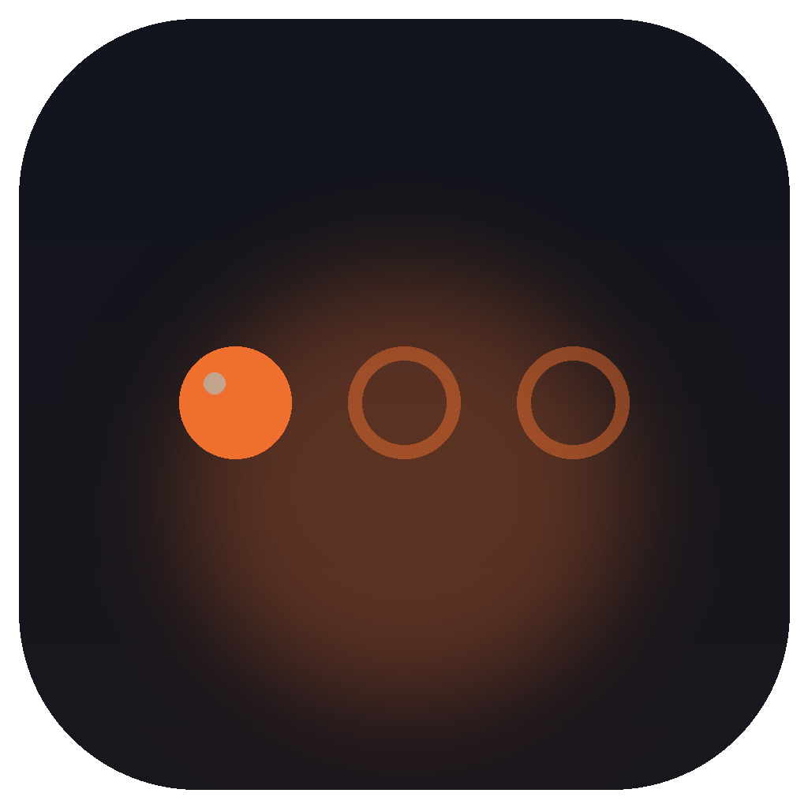
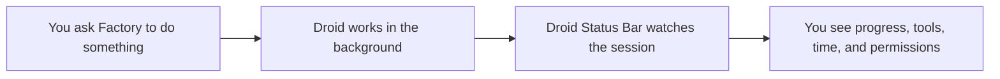

<div align="center">
  
  <h1>Droid Status Bar</h1>
  <p><strong>See what Droid is doing without opening a terminal.</strong><br />A calm, glanceable status indicator for Factory and Droid CLI on macOS.</p>
  <p>
    <a href="https://github.com/rezaularif/Factory-Droid-Cli-Status-Bar/releases/latest"></a>
  </p>
  <p>
    
    
    
  </p>
</div>

The app icon uses the same Droid orange three-dot loader as the default menu-bar animation.

## See it in action

<p align="center">
  
</p>

The recording cycles through the built-in animation styles one by one while retaining the real right-side menu-bar layout, including the system icons and date/time.

## At a glance

| You see | What it means |
| --- | --- |
| 🟠 Animated icon | Droid is actively thinking or using a tool |
| 📝 Live activity | The current action, such as reading a file or running tests |
| ⏱ Elapsed time | How long the current task has been running |
| 🟡 Permission prompt | Droid is waiting for you to approve something |
| 👥 One calm task row | Factory workers are grouped under their main task |

## How it works



Nothing new to learn: keep working in Factory as usual, and glance at the menu bar whenever you want reassurance that the task is moving.

## Install in about 30 seconds

1. Click the **Download for macOS** button above, or download `DroidStatusBar.dmg` from the [latest release](https://github.com/rezaularif/Factory-Droid-Cli-Status-Bar/releases/latest).
2. Open the download and drag **Droid Status Bar** into your **Applications** folder.
3. Open the app once. It installs the Factory connection automatically.

On first launch, macOS may show an unidentified-developer warning because public notarization is not configured yet. Control-click the app, choose **Open**, and confirm once.

<details>
<summary>Technical architecture</summary>

```
hooks/
  lib/common.js     shared helpers (pid, entrypoint, labels, logging)
  update.js         prompt / tool / permission / stop → state files
  lifecycle.js      session start/end → launch app / cleanup
  install.js        merge hooks into ~/.factory/settings.json
  uninstall.js
  test.js           unit tests for helpers
Sources/
  main.swift            entrypoint
  Models.swift          Session, paths, timeouts
  SessionStore.swift    load / evaluate / reap sessions
  GitBranch.swift       branch from .git/HEAD
  MenuViews.swift       toggle + session row
  StatusController.swift menu bar UI + icons
  *Frames.swift         animation assets (unchanged)
```

### Build from source

```bash
cd ~/droid-status-bar
./build.sh
cp -R build/DroidStatusBar.app /Applications/
open /Applications/DroidStatusBar.app   # installs hooks on first launch
```

Or hooks only:

```bash
node hooks/install.js
```

</details>

## Debug

```bash
DROID_STATUSBAR_DEBUG=1 droid
tail -f ~/.factory/statusbar/hooks.log
ls ~/.factory/statusbar/state.d/
node hooks/test.js
```

## Uninstall

```bash
node hooks/uninstall.js
# or
node /Applications/DroidStatusBar.app/Contents/Resources/uninstall.js
```

## Requirements

- macOS 12+
- Droid / Factory CLI
- Node.js (stable path preferred: `/opt/homebrew/bin/node`)

## License

MIT — adapted from [claude-status-bar](https://github.com/m1ckc3s/claude-status-bar). Not affiliated with Factory or Anthropic.
