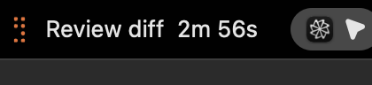

# Droid Status Bar

A tiny macOS menu bar app that shows **Droid** (Factory CLI) live status: animated icon while thinking/running tools, yellow dot for permission prompts, optional elapsed timer.

## See it in action



The recording cycles through the built-in animation styles one by one while retaining the real right-side menu-bar layout, including the system icons and date/time.

## Layout

```
hooks/
  lib/common.js     shared helpers (pid, entrypoint, labels, logging)
  update.js         prompt / tool / permission / stop → state files
  lifecycle.js      session start/end → launch app / cleanup
  install.js        merge hooks into ~/.factory/settings.json
  uninstall.js
  test.js           unit tests for helpers
Sources/
  main.swift            entrypoint
  Models.swift          Session, paths, timeouts
  SessionStore.swift    load / evaluate / reap sessions
  GitBranch.swift       branch from .git/HEAD
  MenuViews.swift       toggle + session row
  StatusController.swift menu bar UI + icons
  *Frames.swift         animation assets (unchanged)
```

## How it works

1. Droid fires hooks → Node scripts write `~/.factory/statusbar/state.d/<session>.json`
2. The app polls that directory and shows the highest-priority session
3. SessionStart launches the app; it quits when no sessions remain (and Factory is closed)

## Install

### Download the latest release

Download `DroidStatusBar.dmg` from the [latest GitHub release](https://github.com/rezaularif/Factory-Droid-Cli-Status-Bar/releases/latest), open it, and drag **Droid Status Bar** into `/Applications`.

On first launch, macOS may show an unidentified-developer warning because public notarization is not configured yet. In that case, Control-click the app in `/Applications`, choose **Open**, and confirm once. The app then installs the Factory hooks automatically.

### Build from source

```bash
cd ~/droid-status-bar
./build.sh
cp -R build/DroidStatusBar.app /Applications/
open /Applications/DroidStatusBar.app   # installs hooks on first launch
```

Or hooks only:

```bash
node hooks/install.js
```

## Debug

```bash
DROID_STATUSBAR_DEBUG=1 droid
tail -f ~/.factory/statusbar/hooks.log
ls ~/.factory/statusbar/state.d/
node hooks/test.js
```

## Uninstall

```bash
node hooks/uninstall.js
# or
node /Applications/DroidStatusBar.app/Contents/Resources/uninstall.js
```

## Requirements

- macOS 12+
- Droid / Factory CLI
- Node.js (stable path preferred: `/opt/homebrew/bin/node`)

## License

MIT — adapted from [claude-status-bar](https://github.com/m1ckc3s/claude-status-bar). Not affiliated with Factory or Anthropic.
